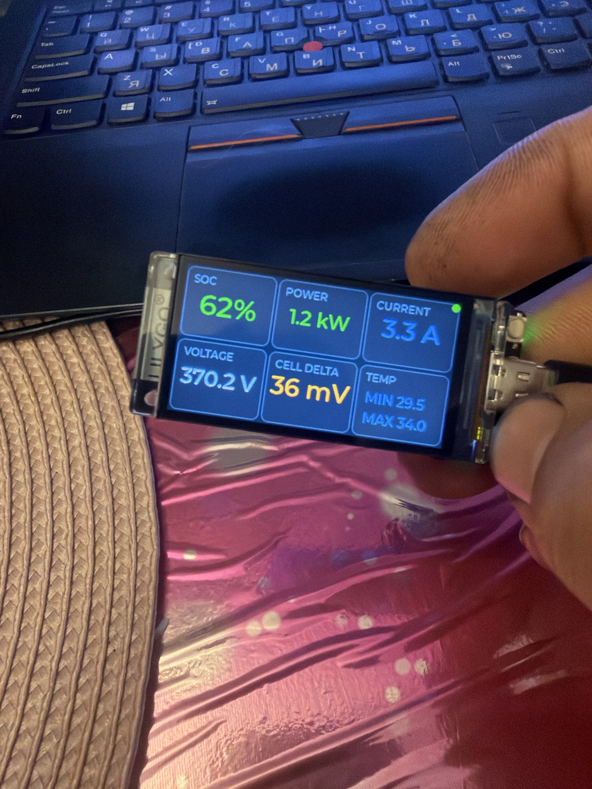
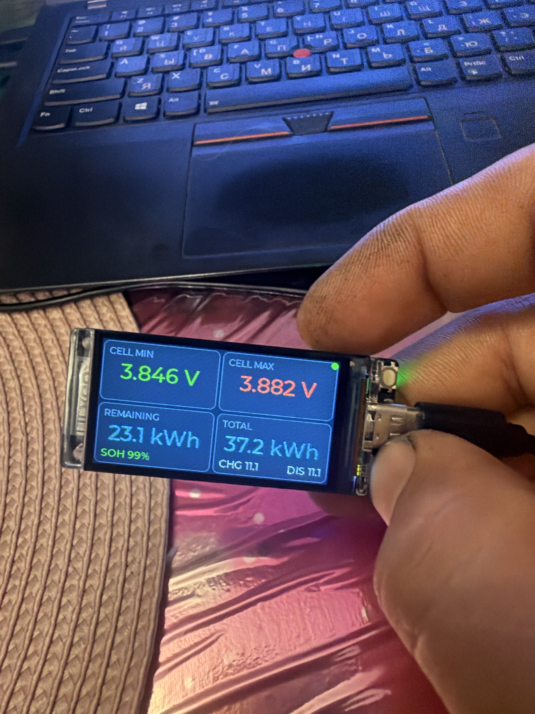
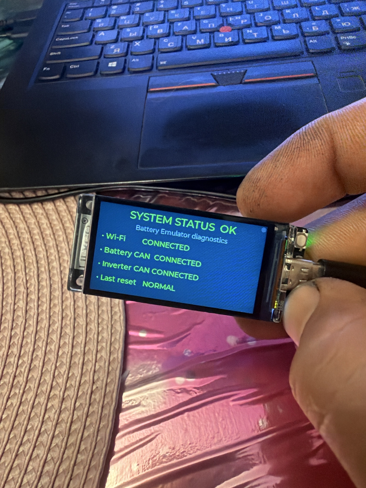
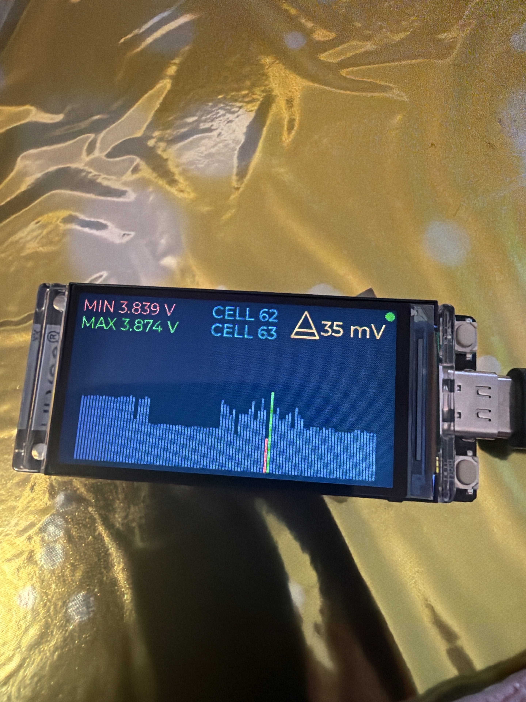

# Battery Display for LILYGO T-Display-S3

An independent wireless dashboard for the [Battery Emulator](https://github.com/dalathegreat/Battery-Emulator), built for the LILYGO T-Display-S3. It receives live data over ESP-NOW and presents the most useful battery information on four compact screens.

[**Install firmware in Chrome or Edge**](https://sort282-rgb.github.io/battery-display-t-display-s3/) · [**Open the project Wiki**](https://github.com/sort282-rgb/battery-display-t-display-s3/wiki)

> This is an independent community project. It is not part of the official Battery Emulator firmware and does not modify the Battery Emulator control logic.

## What it looks like

| Main dashboard | Capacity and cell data |
| --- | --- |
|  |  |

| System diagnostics | Cell-voltage graph |
| --- | --- |
|  |  |

## Features

- Direct ESP-NOW connection — no router is required
- Four switchable information screens
- SOC, power, current, pack voltage and temperature
- Minimum and maximum cell voltage, cell numbers and delta
- Remaining and total energy information
- Phone-based first-time setup
- Web control for brightness, start screen, theme and SOC badge
- Settings preserved during normal firmware updates
- Connection and battery-status diagnostics
- USB web installer with stage, percentage and progress bar

## Install the firmware

1. Open the [web installer](https://sort282-rgb.github.io/battery-display-t-display-s3/) in Google Chrome or Microsoft Edge on a computer.
2. Connect the T-Display-S3 by USB.
3. Select **Update firmware** to preserve saved settings, or **Factory install** for a new board or complete recovery.
4. Choose the serial port and wait for the progress bar to reach 100%.

## First-time phone setup

When phone setup is active, connect the phone to:

- Wi-Fi: `BatteryDisplay-Setup`
- Password: `123456789`
- Address: `http://192.168.4.1`

The display changes to `PHONE CONNECTED` when the phone joins the setup network. The configuration page can select direct ESP-NOW operation or a local Wi-Fi network.

## Hardware

- LILYGO T-Display-S3
- ESP32-S3
- 320 × 170 color display
- USB-C cable capable of data transfer

## Build from source

The project uses PlatformIO and the `lilygo-t-display-s3` environment.

```text
platformio run -e lilygo-t-display-s3
```

Source code is in `src/main.cpp`. Prebuilt firmware images used by the web installer are in `firmware/`.

## Documentation and support

See the [Wiki](https://github.com/sort282-rgb/battery-display-t-display-s3/wiki) for setup, controls and troubleshooting. Issues and improvement ideas can be reported through [GitHub Issues](https://github.com/sort282-rgb/battery-display-t-display-s3/issues).

## Version

Firmware 12.2 CLIENT
